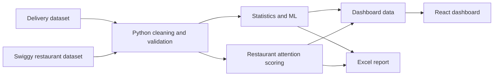

<div align="center">

# QuickCommerce Pulse

**A real-data analytics product for delivery performance and restaurant operations**

[](https://www.python.org/)
[](https://react.dev/)
[](https://www.postgresql.org/)
[](#run-locally)

</div>

## What It Does

QuickCommerce Pulse turns two public food-delivery datasets into a practical
decision-support product.

- **Delivery intelligence:** predicts delivery time and measures the effects of
  distance, preparation time, traffic, weather, and courier experience.
- **Restaurant intelligence:** compares Hyderabad restaurants by delivery time,
  rating, price, and review confidence, then highlights listings that may need
  operational attention.

The datasets do not share an order or restaurant key, so the two analyses remain
separate. No artificial join is used.

## Results

| | |
|---|---:|
| Delivery records analyzed | **1,000** |
| Hyderabad restaurants analyzed | **1,075** |
| Hyderabad areas normalized | **147** |
| Best model | **Linear Regression** |
| Holdout R² | **0.826** |
| Mean absolute error | **5.9 min** |
| Priority restaurant listings | **271** |

Linear Regression outperformed Random Forest and Gradient Boosting on the
holdout set. The analysis also found:

- Rainy deliveries averaged **6.64 minutes longer** than clear-weather deliveries.
- Average delivery time varied by **11.92 minutes** across traffic levels.
- Courier experience had a small negative relationship with delivery time
  (`r = -0.089`).

All three results were statistically significant at the 5% level.

## Product

### React Dashboard

The dashboard brings the analysis into four focused views:

- **Data Command Center** for headline KPIs and operating conditions
- **Restaurant Attention** for ranked Hyderabad listings
- **Model Lab** for model performance, feature importance, and statistical tests
- **Delivery Simulator** for scenario-based delivery estimates

### Excel Operations Report

The generated workbook provides the same findings in a business-ready format,
including an executive summary, area analysis, restaurant attention board,
statistical validation, and model comparison.


### Restaurant Attention Score

The score is intentionally simple and explainable:

```text
45% delivery-time pressure
35% rating weakness
20% review uncertainty
```

Restaurants are classified as `Stable`, `Watch`, or `Priority`. This is an
operational prioritization score, not a churn prediction.

## Architecture



## Technology

| Layer | Tools |
|---|---|
| Data and statistics | Python, pandas, NumPy, SciPy |
| Machine learning | scikit-learn |
| Database analysis | PostgreSQL |
| Dashboard | React, Vite, Recharts |
| Reporting | Excel workbook automation |
| Quality | unittest, ESLint |

## Repository

```text
data/          Raw-data placeholder and processed-data manifest
scripts/       Cleaning, analysis, and workbook generation
analysis/      Statistical, model, area, and attention outputs
sql/           PostgreSQL schema and analytical queries
dashboard/     React decision dashboard
excel/         Generated operations report and previews
tests/         Pipeline and data-contract tests
docs/          Dataset setup and project brief
```

## Run Locally

### 1. Add the datasets

Place these files in `data/raw/`:

```text
Food_Delivery_Times.csv
swiggy.csv
```

Dataset details and expected columns are documented in
[`docs/data_setup.md`](docs/data_setup.md).

### 2. Run the data pipeline

```bash
python -m venv .venv

# Windows
.venv\Scripts\activate

pip install -r requirements.txt
python scripts/prepare_real_data.py
python scripts/run_analysis.py
```

### 3. Start the dashboard

```bash
cd dashboard
npm install
npm run dev
```

### 4. Validate the project

```bash
python -m unittest discover tests -v

cd dashboard
npm run lint
npm run build
```

## Data Notes

- The delivery dataset is not Hyderabad-specific and includes a `Snowy`
  weather category.
- It has no city, restaurant, date, or event identifier.
- Listed restaurant delivery time is not observed order-level delivery time.
- The two datasets cannot be joined at row level.

These constraints are stated directly because credible analysis matters more
than forcing the data to tell a larger story.
