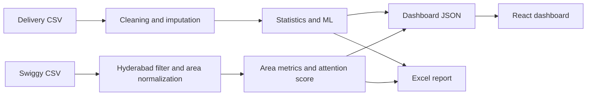

<div align="center">

# QuickCommerce Pulse

### Real-Data Delivery Benchmark and Hyderabad Restaurant Intelligence

A portfolio analytics product combining delivery-time prediction, statistical
testing, PostgreSQL analysis, restaurant attention scoring, Excel reporting,
and a React decision interface.


</div>

---

## Overview

QuickCommerce Pulse uses two real public Kaggle datasets:

1. **1,000 delivery records** for delivery-time prediction and operational analysis.
2. **8,680 Swiggy restaurant listings**, filtered to **1,075 Hyderabad restaurants**.

The datasets have no shared restaurant or order identifier. Therefore, they are
analyzed as two connected but separate tracks rather than being artificially
joined.

## Current Results

| Metric | Result |
|---|---:|
| Delivery records | 1,000 |
| Hyderabad restaurant listings | 1,075 |
| Normalized Hyderabad areas | 147 |
| Average delivery time | 56.7 minutes |
| Best prediction model | Linear Regression |
| Holdout R2 | 0.826 |
| Mean absolute error | 5.9 minutes |
| Priority restaurant listings | 271 |

## Track 1: Delivery-Time Intelligence

The delivery dataset contains:

- Distance
- Weather
- Traffic level
- Time of day
- Vehicle type
- Preparation time
- Courier experience
- Delivery time

### Models compared

- Linear Regression
- Random Forest Regressor
- Gradient Boosting Regressor

Linear Regression currently performs best:

| Model | R2 | MAE | RMSE |
|---|---:|---:|---:|
| Linear Regression | 0.826 | 5.90 | 8.83 |
| Random Forest | 0.797 | 6.60 | 9.54 |
| Gradient Boosting | 0.793 | 6.51 | 9.63 |

### Statistical findings

| Question | Method | Result |
|---|---|---:|
| Rainy vs clear delivery time | Welch t-test | Rainy orders average +6.64 min |
| Traffic-level differences | One-way ANOVA | 11.92 min range |
| Courier experience relationship | Pearson correlation | -0.089 |

All three relationships are statistically significant at the 5% threshold.

## Track 2: Hyderabad Restaurant Intelligence

The Swiggy dataset is filtered to Hyderabad and used to compare:

- Listed delivery time
- Average rating
- Review volume
- Price
- Cuisine
- Locality

### Operational attention score

Each restaurant receives a transparent cross-sectional score:

```text
Attention Score =
45% listed delivery pressure
+ 35% rating weakness
+ 20% review uncertainty
```

Listings are segmented into:

- `Stable`
- `Watch`
- `Priority`

This is **not a churn prediction model** because the supplied dataset has no
historical order or rating trend.

## Dashboard

The React interface contains:

### Data Command Center

- Real-data KPIs
- Hyderabad area comparison
- Weather effects
- Traffic effects

### Restaurant Attention

- Ranked Hyderabad listings
- Rating and review evidence
- Delivery-time pressure
- Score explanation

### Model Lab

- Holdout model comparison
- R2, MAE, and RMSE
- Feature importance
- Statistical tests

### Delivery Simulator

The simulator estimates delivery time from:

- Distance
- Preparation time
- Weather
- Traffic
- Time of day
- Courier experience

It uses observed category differences and simple numeric slopes. It is an
explanatory tool and does not call the trained model directly.

## Excel Operations Report

The generated workbook includes:

- Executive dashboard
- Hyderabad area intelligence
- Restaurant attention board
- Statistical validation
- Model performance and feature importance


## Architecture



## Repository Structure

```text
quickcommerce-pulse/
|-- data/
|   |-- raw/                    # User-downloaded Kaggle files, ignored by Git
|   `-- processed/              # Cleaned files and manifest
|-- scripts/
|   |-- prepare_real_data.py
|   |-- run_analysis.py
|   `-- build_ops_workbook.mjs
|-- analysis/                   # Model, statistics, area, and attention outputs
|-- sql/                        # PostgreSQL schema and analytical queries
|-- models/                     # Trained prediction pipeline
|-- excel/                      # Generated workbook and previews
|-- dashboard/                  # React interface
|-- ai_insights/                # Optional Gemini executive summary
|-- tests/                      # Data-contract and model tests
`-- docs/data_setup.md
```

## Run Locally

### 1. Add datasets

Place the following files inside `data/raw/`:

```text
Food_Delivery_Times.csv
swiggy.csv
```

### 2. Install Python dependencies

```bash
python -m venv .venv
.venv\Scripts\activate
pip install -r requirements.txt
```

### 3. Run the pipeline

```bash
python scripts/prepare_real_data.py
python scripts/run_analysis.py
node scripts/build_ops_workbook.mjs
```

### 4. Start the dashboard

```bash
cd dashboard
npm install
npm run dev
```

### 5. Validate

```bash
python -m unittest discover tests -v
cd dashboard
npm run lint
npm run build
```

## Data Limitations

- The delivery dataset contains no city, restaurant, date, or event field.
- It includes categories such as `Snowy`, so it is not Hyderabad-specific.
- The restaurant and delivery datasets cannot be joined at row level.
- Listed restaurant delivery time is not the same as observed order-level delivery time.
- The attention score is a prioritization heuristic, not churn probability.

These limitations are deliberately visible in the code, dashboard, and
documentation.

## Resume Narrative

> Built a real-data analytics product using 1,000 delivery records and 1,075
> Hyderabad Swiggy restaurant listings. Trained and compared three delivery-time
> models, achieving 0.826 holdout R2 and 5.9-minute MAE, validated weather,
> traffic, and courier-experience effects statistically, and created a
> transparent restaurant attention score with Excel and React reporting layers.
