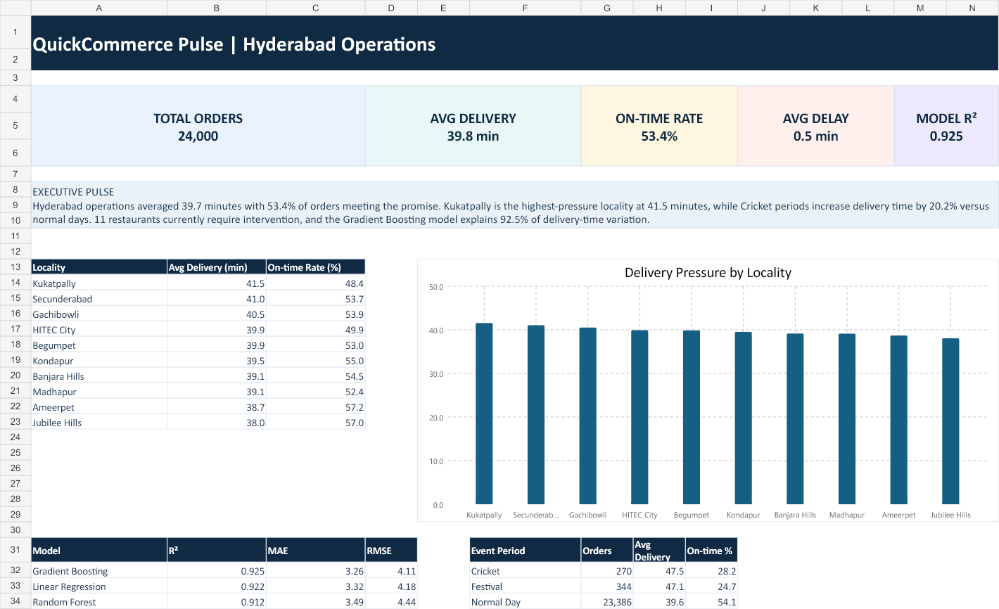
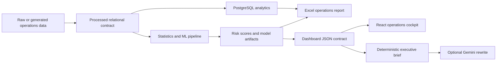

<div align="center">

# QuickCommerce Pulse

### Hyderabad Delivery Intelligence Platform

An end-to-end analytics product that predicts delivery time, detects restaurant
risk, quantifies festival and cricket surges, and converts operating metrics
into an executive-ready action brief.


</div>

---

## The Product Question

Delivery dashboards usually explain what already happened. QuickCommerce Pulse
asks a more useful question:

> Where will the network fail next, why is it happening, and what should an
> operations manager change before the next rush?

The project combines SQL, statistical testing, machine learning, restaurant
risk scoring, Excel reporting, and a React decision cockpit into one
reproducible workflow.

## Current Results

| Metric | Result |
|---|---:|
| Orders analyzed | 24,000 |
| Hyderabad localities | 10 |
| Restaurants scored | 80 |
| Best model | Gradient Boosting |
| Holdout R² | 0.925 |
| Mean absolute error | 3.26 minutes |
| Critical restaurants flagged | 11 |
| Highest-pressure locality | Kukatpally |
| Cricket-period delivery lift | 20.2% |

All current figures are generated from the repository's fixed-seed synthetic
operations dataset. This is stated explicitly to keep the portfolio evidence
honest and reproducible. The raw-data adapter is designed for the referenced
Kaggle datasets.

## What Makes It Different

### Restaurant risk, not just delivery prediction

Each restaurant receives a composite intervention score based on:

- Recent order-volume decline
- Rating deterioration
- Average delivery delay
- On-time reliability

The result is a ranked risk board with `Stable`, `Watch`, and `Critical`
segments.

### Hyderabad operating context

The network is modeled across Gachibowli, Madhapur, HITEC City, Banjara Hills,
Jubilee Hills, Kukatpally, Kondapur, Ameerpet, Begumpet, and Secunderabad.

### Event and weather intelligence

The analysis isolates rain, traffic, festivals, and Hyderabad cricket matches.
Welch t-tests and ANOVA quantify whether observed effects are statistically
significant.

### Decision simulator

The React cockpit lets an operator change:

- Locality
- Weather severity
- Peak-hour pressure
- Festival or cricket demand
- Additional delivery partners

It immediately estimates the resulting delivery time and recommends an
operating action.

### AI executive layer

A deterministic briefing is always generated from verified metrics. An
optional Gemini script can rewrite that context into a concise executive
summary without inventing values.

## Product Surfaces

### Operations Cockpit

- Network KPI cards
- Hyderabad pressure map
- Locality ranking
- Hourly delivery pulse
- Festival and cricket comparison

### Restaurant Risk Board

- Sortable intervention queue
- Volume and rating movement
- Delay and reliability metrics
- Recommended operating playbook

### Model Lab

- Holdout model comparison
- R², MAE, and RMSE
- Permutation feature importance
- Statistical hypothesis results

### Excel Operations Report

The generated workbook includes:

- Executive dashboard
- Area performance table
- Restaurant risk board
- Statistical validation
- Model performance and feature importance



## Architecture



## Repository Structure

```text
quickcommerce-pulse/
|-- data/
|   |-- raw/                  # Kaggle source integration point
|   `-- processed/            # Reproducible analysis-ready data
|-- sql/
|   |-- schema.sql
|   `-- analysis_queries.sql
|-- scripts/
|   |-- generate_demo_data.py
|   |-- run_analysis.py
|   `-- build_ops_workbook.mjs
|-- analysis/                 # Risk, statistics, and model outputs
|-- models/                   # Trained delivery-time pipeline
|-- ai_insights/              # Executive summary layer
|-- excel/                    # Generated operations workbook
|-- dashboard/                # React decision cockpit
|-- tests/                    # Pipeline and data-contract tests
`-- docs/                     # Project brief and data replacement guide
```

## Analytical Methods

### Feature engineering

- Haversine delivery distance
- Order hour and day of week
- Peak-hour indicator
- Festival and cricket event indicator
- Weather and traffic categories
- Multi-delivery batching
- Restaurant preparation time

### Models compared

- Linear Regression
- Random Forest Regressor
- Gradient Boosting Regressor

The selected model is determined by holdout R² rather than hardcoded preference.

### Statistical tests

| Hypothesis | Method | Current effect |
|---|---|---:|
| Rain increases delivery time | Welch t-test | +13.3 min |
| Traffic levels differ | One-way ANOVA | 20.3 min range |
| Events increase delivery time | Welch t-test | +7.8 min |

## Run the Project

### 1. Create the analytics environment

```bash
python -m venv .venv
.venv\Scripts\activate
pip install -r requirements.txt
```

### 2. Generate data and analysis

```bash
python scripts/generate_demo_data.py
python scripts/run_analysis.py
```

### 3. Build the Excel report

```bash
node scripts/build_ops_workbook.mjs
```

### 4. Run the dashboard

```bash
cd dashboard
npm install
npm run dev
```

### 5. Validate

```bash
python -m unittest discover tests
cd dashboard
npm run lint
npm run build
```

## Data Sources and Integrity

The project brief references:

- Kaggle Food Delivery Time Prediction dataset
- Kaggle Swiggy Restaurants dataset
- Open-Meteo historical weather API

These authenticated raw files were not available during the first build.
Therefore, the repository includes a documented synthetic generator instead
of silently claiming simulated records as observed business data.

See [the replacement guide](docs/data_replacement_guide.md) for the source-data
contract and migration steps.

## Roadmap

- Add authenticated Kaggle ingestion adapters
- Enrich historical records with Open-Meteo weather
- Load the relational model into PostgreSQL
- Publish the React cockpit on Vercel
- Add map tiles and locality polygons
- Add SHAP explanations and prediction intervals
- Schedule daily executive brief generation
- Build a Power BI companion dashboard

## Portfolio Narrative

> Built a full-stack Hyderabad delivery intelligence platform across SQL,
> statistics, machine learning, Excel, and React. Compared three prediction
> models, achieved 0.925 holdout R² with a Gradient Boosting model, quantified
> rain and event-driven delay effects, and created a restaurant intervention
> score plus an operations what-if simulator.

---

Built as a transparent, reproducible analytics product rather than a dashboard
mockup.

